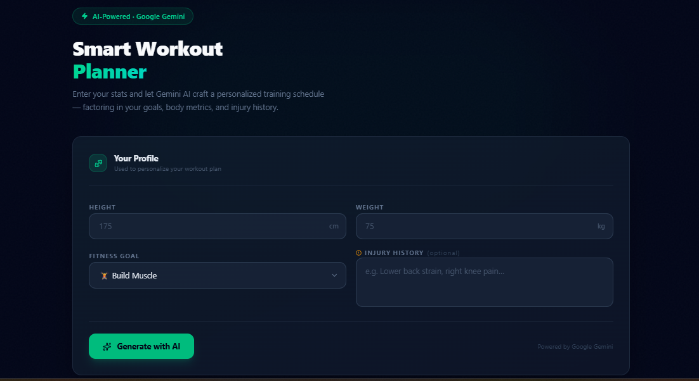
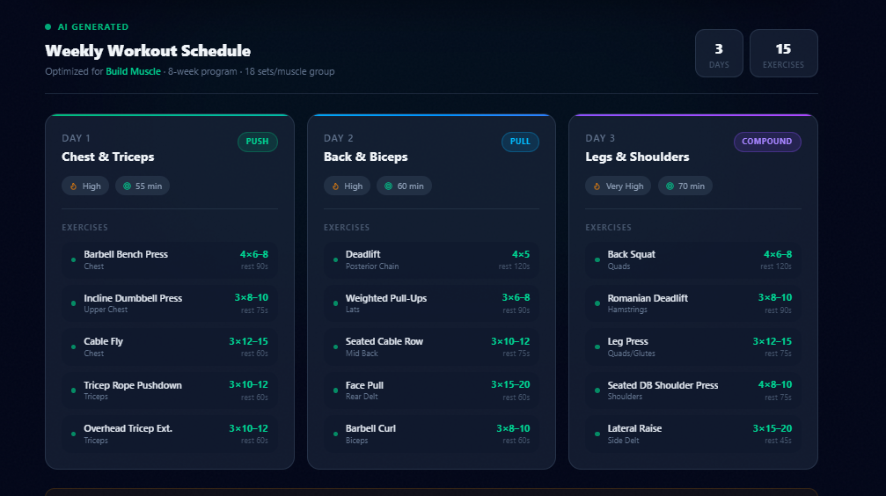
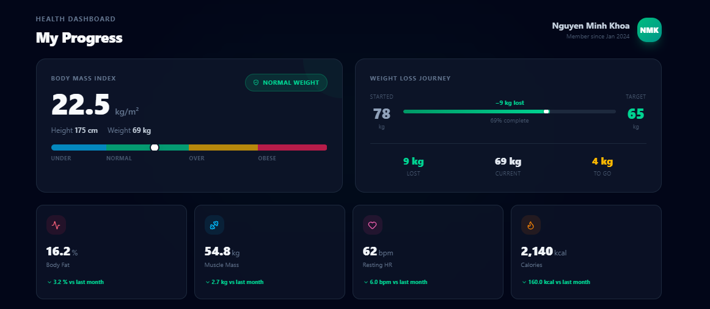
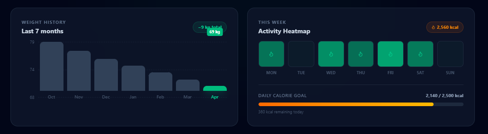
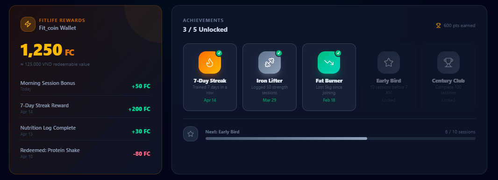
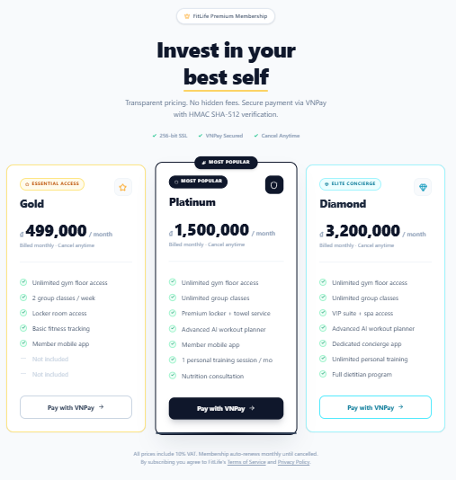
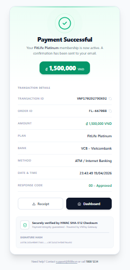

# 🎨 FitLife Frontend - Client Application

[]()
[]()
[]()

> The modern, responsive, and blazing-fast user interface for the FitLife Ecosystem, designed for both Gym Admins and Members.

## 📸 System UI Showcase

### 🤖 1. AI-Powered Workout Planner (Google Gemini)
Generates personalized, highly optimized weekly workout routines based on member metrics and goals.



### 📈 2. Member Health Analytics & Gamification
Comprehensive dashboard for tracking BMI, weight loss journeys, activity heatmaps, and Fit_coin rewards to boost retention.

<div align="center">
  
  
</div>

### 💳 3. Subscription & Secure Payment (VNPay)
Transparent tier-based pricing model with secure payment validation via HMAC SHA-512 Checksum.
<div align="center">
  
  
</div>

## ✨ Core Features & Tech Stack
- **Build Tool:** **Vite** for blazing-fast HMR (Hot Module Replacement) and optimized production builds.
- **State Management:** **Zustand** for clean, scalable, and boilerplate-free global state management.
- **Styling:** **TailwindCSS** for a utility-first, fully responsive mobile-first design.
- **API Communication:** **Axios** instance configured with custom Interceptors for automatic JWT Bearer token injection and centralized error handling (e.g., auto-logout on 401 Unauthorized).

## 🚀 Quick Start

### 1. Install Dependencies
```bash
npm install
### 2. Environment Setup
Create a `.env` file in the root directory to point to the Backend API:
```Code snippet
VITE_API_BASE_URL=http://localhost:8080/api/v1
```
### 3. Run Development Server
```bash
npm run dev
```
### 4. Build for Production
```bash
npm run build
```
