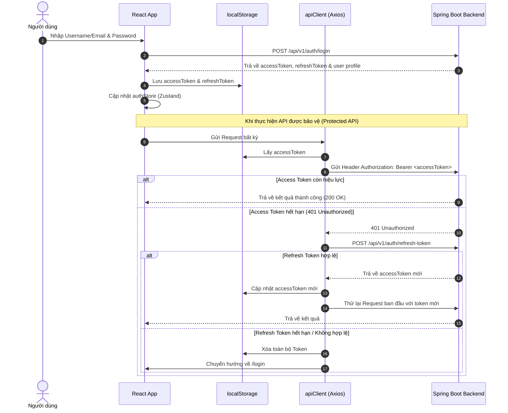

# Tài liệu Quy trình Xử lý Toàn bộ Hệ thống Frontend (FitLife Frontend Workflow)

## 📌 1. Tổng quan Kiến trúc Frontend

Hệ thống Frontend **FitLife** được xây dựng bằng React 19, TypeScript, Vite, TailwindCSS và Zustand. Được thiết kế theo mô hình tách biệt trách nhiệm (Separation of Concerns) nhằm đảm bảo mã nguồn dễ bảo trì, mở rộng và đồng bộ với Core Backend (Java Spring Boot).

```
c:\Users\nguye\Downloads\fit-front\src
├── components/          # Các Component giao diện tái sử dụng (Button, Input, Card, Modal, Badge...)
├── config/              # Cấu hình routes và hằng số toàn cục
├── hooks/               # Custom hooks quản lý logic và trạng thái giao diện theo từng phân hệ
├── pages/               # Các trang giao diện chính (Admin, Member, Public)
├── router/              # Cấu hình React Router và Protected Routes (Phân quyền Admin/Staff/Member)
├── services/            # Lớp giao tiếp API HTTP với Core Backend qua Axios
├── store/               # Zustand global store (authStore quản lý phiên làm việc)
├── types/               # Type định nghĩa DTOs, Request/Response và Entity Data Models
└── utils/               # Tiện ích bổ trợ
    ├── alert.ts         # Quản lý SweetAlert2 popup / Toast notification
    ├── apiClient.ts     # Axios instance cấu hình Interceptor tự động làm mới token
    └── validators/      # Tách riêng toàn bộ logic kiểm tra dữ liệu CRUD (Tái sử dụng)
```

---

## 🔐 2. Quy trình Xác thực & Quản lý Token (Authentication Lifecycle)



---

## 🛡️ 3. Quy tắc Kiểm tra Dữ liệu & Xử lý Form (Validation Pattern)

Theo quy định dự án (`.agents/AGENTS.md`), **toàn bộ logic kiểm tra dữ liệu (Form Validation)** khi thực hiện các thao tác Thêm/Sửa/Xóa (CRUD) bắt buộc phải được tách riêng ra khỏi React Component vào thư mục `src/utils/validators/`.

### Danh sách Validator Utilities:
- `adminMemberValidator.ts`: Kiểm tra username (4-50 ký tự), password (6-100 ký tự), email đúng định dạng, số điện thoại Việt Nam, tuổi từ 10 trở lên, trùng lặp thông tin.
- `adminPackageValidator.ts`: Kiểm tra giá gói tập > 0, tên gói, mô tả.
- `adminEquipmentValidator.ts`: Kiểm tra số lượng thiết bị, ngày bảo trì.
- `profileValidator.ts`: Kiểm tra cập nhật thông tin cá nhân.
- `forgotPasswordValidator.ts` & `resetPasswordValidator.ts`: Kiểm tra form quên/đổi mật khẩu.

### Quy trình Xử lý Chặn (Validation Blocking Flow):
1. Người dùng bấm Submit Form.
2. Hook gọi hàm Validator tương ứng (ví dụ: `validateAdminMemberForm`).
3. Nếu dữ liệu không hợp lệ:
   - Validator tự động hiển thị thông báo lỗi qua `showAlert.error(...)`.
   - Hàm trả về `false`.
   - Hook **dừng ngay lập tức** (ngắt không gọi API xuống Backend).
4. Nếu dữ liệu hợp lệ (`true`), hook mới tiến hành bật trạng thái `loading` và gọi `memberService`.

---

## 🚨 4. Quy trình Xử lý Lỗi & Cảnh báo (Error Handling & Alerting)

Hệ thống tuân thủ các nguyên tắc xử lý lỗi nghiêm ngặt:
- **Không tự động cập nhật Local State khi API thất bại**: Nếu lệnh khóa tài khoản, cập nhật hoặc xóa gặp lỗi từ Backend, hệ thống giữ nguyên trạng thái cũ trên giao diện và hiển thị Alert thông báo lỗi.
- **Không chèn dữ liệu ngẫu nhiên (Phantom Records)**: Ngừng việc tạo ID giả bằng `Math.random()` khi gọi API thêm mới thất bại.
- **Trích xuất thông báo lỗi linh hoạt**:
  ```typescript
  try {
    await memberService.updateMemberStatus(id, status);
    showAlert.success("Thành công", "Đã cập nhật trạng thái");
  } catch (error: unknown) {
    const message = (error as any)?.response?.data?.message || "Không thể thực hiện thao tác.";
    showAlert.error("Thất bại", message);
  }
  ```

---

## 🔄 5. Các Phân hệ Chức năng Chính (Module Workflows)

### 👥 Phân hệ Quản lý Hội viên (Member Management)
- **Service**: `memberService.ts`
- **Hook**: `useUserManagement.ts`
- **Các Endpoint**:
  - `GET /members/me` (Hội viên xem hồ sơ của mình)
  - `GET /admin/members` (Admin phân trang & tìm kiếm hội viên)
  - `POST /admin/members` (Admin tạo mới hội viên)
  - `PUT /admin/members/{id}` (Admin cập nhật hội viên)
  - `PATCH /admin/members/{id}/status` (Admin khóa/mở khóa hội viên)

### 💳 Phân hệ Thanh toán & VNPay (Payments Integration)
- **Service**: `paymentService.ts`
- **Luồng xử lý VNPay**:
  1. Người dùng chọn gói tập và phương thức thanh toán VNPay.
  2. Frontend gọi `POST /payments/vnpay/create-payment-url`.
  3. Backend sinh URL thanh toán VNPay bảo mật và trả về Frontend.
  4. Frontend chuyển hướng người dùng sang Cổng thanh toán VNPay (`window.location.href = vnpayUrl`).
  5. Sau khi thanh toán, VNPay chuyển hướng về `/payment/vnpay-return`.
  6. Component `VNPayReturnPage.tsx` gửi tham số URL tới Backend `GET /payments/vnpay/return` để xác minh chữ ký checksum HMAC-SHA512 và cập nhật trạng thái đơn hàng.

### 🚪 Phân hệ Check-in (Check-in Management)
- **Service**: `checkinService.ts`
- **Luồng Self-Service**: Hội viên dùng App quét mã QR cổng tập `POST /member/check-ins/me`.
- **Luồng Lễ tân Quét mã (Staff Scan)**: Nhân viên nhập mã hội viên hoặc quét mã barcode `POST /check-ins/manual`.

### 🤖 Phân hệ AI Workout & Nutrition Plan
- **Service**: `aiService.ts`
- **Luồng xử lý**:
  1. Hội viên gửi thông tin mục tiêu sức khỏe và chỉ số cơ thể (BMI/BMR).
  2. Frontend gọi `POST /ai/suggestion`.
  3. Backend gọi Gemini AI engine để sinh lộ trình tập luyện & dinh dưỡng phù hợp.
  4. Người dùng xem chi tiết và bấm "Áp dụng kế hoạch" (`POST /ai/plan/apply/{id}`).

---

## 📑 6. Đồng bộ Danh mục API giữa Frontend & Backend

| Phân hệ | Route Frontend | HTTP Method | Endpoint Core Backend (`/api/v1`) | Quyền truy cập |
| :--- | :--- | :--- | :--- | :--- |
| **Auth** | `/login` | POST | `/auth/login` | Public |
| **Auth** | `/register` | POST | `/auth/register` | Public |
| **Auth** | Refresh Token | POST | `/auth/refresh-token` | Public |
| **Member** | `/admin/users` | GET | `/admin/members` | ADMIN / STAFF |
| **Member** | Thêm mới | POST | `/admin/members` | ADMIN / STAFF |
| **Check-in**| Quét mã | POST | `/check-ins/manual` | ADMIN / STAFF |
| **Check-in**| Tự Check-in | POST | `/member/check-ins/me` | MEMBER |
| **VNPay** | Tạo URL | POST | `/payments/vnpay/create-payment-url` | MEMBER |
| **VNPay** | Callback | GET | `/payments/vnpay/return` | Public |
